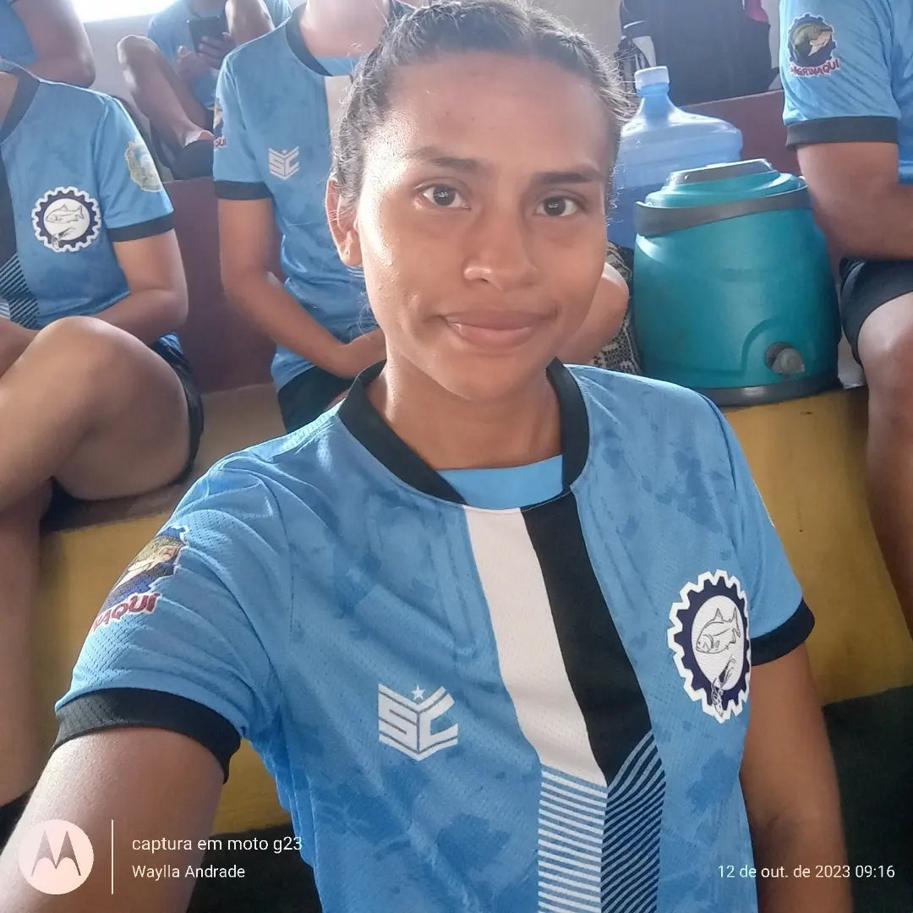

# Meu Perfil
{width=5%}  
**Nome:** Waylla Andrade  
**Idade:** 24  
**Sexo:** Feminino  
**Nacionalidade:** Brasileira  
**Endereço:** Travessa 12 de outubro, s/n, Bairro Cidade Nova  
**Email:** waylla.andrade2018@gmail.com  
**Telefone:**  (93) 99104-9529  
**Escolaridade:** Ensino superior incompleto  
**Curso:** Bacharelado em Engenharia de Aquicultura  

Sou uma pessoa de fé e amor, dedicada à minha família, incluindo meu esposo e filhos. Tenho paixão por ler livros de terror e romance, além de praticar esportes como tênis de mesa e futsal. Estudo Engenharia de Aquicultura, focando na linguagem R para análise de dados. Amo gatos e cachorros, que são parte essencial da minha vida. Esses elementos combinados formam uma jornada rica e diversificada.

# Currículo Lattes
Demonstro pensamento crítico, habilidade na tomada de decisões complexas e inteligência emocional. Minha criatividade se destaca na resolução de problemas, e mantenho eficácia na colaboração e trabalho em equipe. Comunicação interpessoal clara e habilidades de liderança inspiradora complementam meu perfil, contribuindo para ambientes acadêmicos e profissionais bem-sucedidos.

Atenciosamente, 

Waylla Andrade

[Currículo lattes](http://lattes.cnpq.br/0994725697326102)

# Redes Sociais
[Facebook](https://www.facebook.com/waylla.andradedoamaral/?locale=sw_KE)
{width=5%}

[Instagram](https://www.instagram.com/)
{width=4%}  

[twitter](https://twitter.com/i/flow/login?input_flow_data=%7B%22requested_variant%22%3A%22eyJsYW5nIjoicHQifQ%3D%3D%22%7D)
{width=5%}  

# Sobre
**Equipe**  
**Orientador**  
**Monitores:** Daniel Siqueira, Gabriel Rodrigues, Luan Patrick  
**Discente:** Waylla Maria Andrade do Amaral  

**Objetivos:**
O curso tem o intuito de ensinar os discentes da universidade Federal do Oeste do Pará (Ufopa) *campus* Monte Alegre a linguagem R de programação. Eles irão aprender a utilizar os programas de versionamento Git e GitHub, construir roteiros no RMarkdown, criar Dashboards Interativo e aplicativos no R Shiny.
Esse Projeto servirá para ajudar em disciplinas que envolvam a utilização do Programa R, em trabalhos acadêmicos e no enriquecimento do conhecimento em programação muito exigido no mercado de trabalho.

